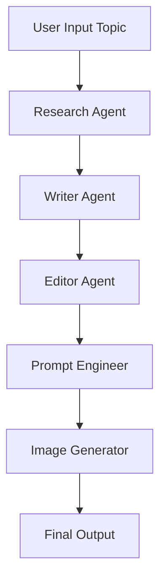

# 🤖 AI-Powered Instagram Content Generator

[](https://www.python.org/downloads/)
[](https://www.crewai.com/)
[](LICENSE)

An intelligent multi-agent system that automatically generates Instagram-ready content with AI-generated images. Using CrewAI framework and Groq LLM, this project creates engaging social media posts through collaborative AI agents.

## 🌟 Features

- **Multi-Agent Collaboration**: Four specialized AI agents working together
- **Automated Research**: Gathers trending information about any topic
- **Content Writing**: Creates engaging Instagram captions with hashtags
- **Content Review**: Ensures high-quality, error-free posts
- **AI Image Generation**: Creates stunning visuals using Pollinations AI (Flux Model)
- **Free API**: Uses Groq's free LLM API (no OpenAI costs!)

## 🎯 How It Works

The system uses four specialized agents:

1. **Senior Research Analyst** 📊
   - Researches topics and identifies key trends
   - Gathers fascinating facts and statistics

2. **Instagram Content Strategist** ✍️
   - Writes catchy hooks and engaging captions
   - Creates relevant hashtags

3. **Senior Content Editor** 📝
   - Reviews content for clarity and grammar
   - Ensures engaging tone

4. **AI Visual Specialist** 🎨
   - Generates detailed image prompts
   - Optimized for AI image generation

## 📋 Prerequisites

- Python 3.11 or higher
- Groq API Key (Free: [Get it here](https://console.groq.com/))
- Internet connection

## 🚀 Installation

### 1. Clone the Repository

```bash
git clone https://github.com/yourusername/instagram-content-generator.git
cd instagram-content-generator
```

### 2. Install Dependencies

```bash
pip install crewai crewai-tools requests Pillow
```

Or using requirements.txt:

```bash
pip install -r requirements.txt
```

### 3. Get Your Groq API Key

1. Visit [Groq Console](https://console.groq.com/)
2. Sign up for a free account
3. Generate an API key
4. Copy your API key

### 4. Configure API Key

Replace the API key in the code:

```python
os.environ["OPENAI_API_KEY"] = "your_groq_api_key_here"
```

## 💻 Usage

### Basic Usage

```python
# Set your topic
topic = "The Beauty of Cox's Bazar"

# Run the crew
result = crew.kickoff(inputs={'topic': topic})
```

### Complete Example

```python
import os
from crewai import Agent, Task, Crew

# Setup API
os.environ["OPENAI_API_KEY"] = "gsk_your_groq_api_key"
os.environ["OPENAI_API_BASE"] = "https://api.groq.com/openai/v1"
os.environ["OPENAI_MODEL_NAME"] = "llama-3.3-70b-versatile"

# Define agents and tasks (see full code)
# ...

# Generate content
topic = "AI in Healthcare"
result = crew.kickoff(inputs={'topic': topic})
```

### Run from Command Line

```bash
python instagram_generator.py
```

## 📁 Project Structure

```
instagram-content-generator/
│
├── instagram_generator.py    # Main application
├── requirements.txt           # Python dependencies
├── README.md                 # This file
├── LICENSE                   # MIT License
└── examples/                 # Example outputs
    ├── sample_post.txt
    └── sample_image.png
```

## 🎨 Output Example

**Topic**: The Beauty of Cox's Bazar

**Generated Post**:
```
Discover the Hidden Gem of Cox's Bazar! 🏖️

Explore the world's longest natural sea beach, vibrant culture, 
and breathtaking biodiversity!

Imagine walking along the world's longest natural sea beach, 
feeling the soft white sand between your toes and witnessing 
the majestic sunrise over the Bay of Bengal...

#CoxsBazar #LongestSeaBeach #BangladeshTourism #NaturalWonders 
#CulturalHeritage #TravelDiaries #BeachLife #WildlifeConservation 
#TouristDestination #ParadiseFound
```

**Plus**: High-quality AI-generated image (768x512 HD)

## 🛠️ Customization

### Change AI Model

```python
# Use different Groq models
os.environ["OPENAI_MODEL_NAME"] = "mixtral-8x7b-32768"
# or
os.environ["OPENAI_MODEL_NAME"] = "llama-3.1-70b-versatile"
```

### Modify Image Settings

```python
# Change image dimensions
image_url = f"https://image.pollinations.ai/prompt/{encoded_prompt}?model=flux&width=1024&height=768&seed={seed}&nologo=true"
```

### Adjust Agent Behavior

```python
researcher = Agent(
    role='Senior Research Analyst',
    goal='Your custom goal here',
    backstory="Your custom backstory",
    allow_delegation=True,  # Enable agent collaboration
    verbose=True
)
```

## 📊 System Workflow



## 🔧 Troubleshooting

### API Key Issues

**Error**: `Invalid API key`
- **Solution**: Verify your Groq API key is correct
- Get a new key from [Groq Console](https://console.groq.com/)

### Image Generation Fails

**Error**: `Connection timeout`
- **Solution**: Check internet connection
- Try again after a few seconds
- The Pollinations API is free but may be rate-limited

### Import Errors

**Error**: `ModuleNotFoundError: No module named 'crewai'`
- **Solution**: Run `pip install crewai crewai-tools`

## 🌐 API Services Used

| Service | Purpose | Cost |
|---------|---------|------|
| Groq | LLM Processing | Free |
| Pollinations AI | Image Generation | Free |
| CrewAI | Agent Framework | Open Source |

## 🎓 Learning Resources

- [CrewAI Documentation](https://docs.crewai.com/)
- [Groq Documentation](https://console.groq.com/docs)
- [Pollinations AI](https://pollinations.ai/)

## 🤝 Contributing

Contributions are welcome! Please feel free to submit a Pull Request.

1. Fork the project
2. Create your feature branch (`git checkout -b feature/AmazingFeature`)
3. Commit your changes (`git commit -m 'Add some AmazingFeature'`)
4. Push to the branch (`git push origin feature/AmazingFeature`)
5. Open a Pull Request

## 📝 To-Do

- [ ] Add support for multiple image styles
- [ ] Implement content scheduling
- [ ] Add analytics tracking
- [ ] Support for other social media platforms
- [ ] Web interface with Streamlit
- [ ] Database integration for content history

## 📄 License

This project is licensed under the MIT License - see the [LICENSE](LICENSE) file for details.

## 🙏 Acknowledgments

- CrewAI team for the amazing framework
- Groq for providing free LLM access
- Pollinations AI for free image generation
- Open source community

## 📧 Contact

Your Name - [@yourtwitter](https://twitter.com/yourtwitter)

Project Link: [https://github.com/yourusername/instagram-content-generator](https://github.com/yourusername/instagram-content-generator)

---

⭐ **If you find this project helpful, please give it a star!** ⭐

Made with ❤️ using CrewAI and Python
